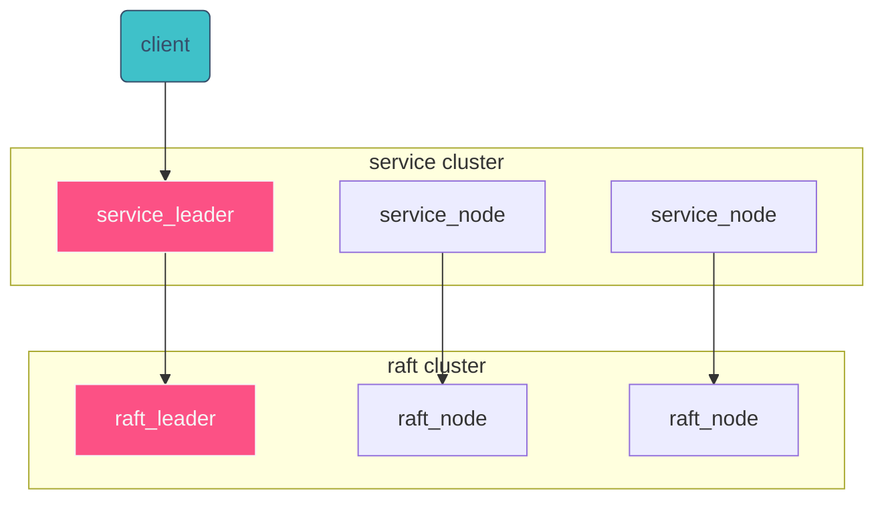

# mit-6.824-2021

Go implements of mit-6.824 labs.

 [](https://github.com/JellyZhang/mit-6.824-2021/actions/workflows/go.yml) ⬅️ test results may be different in different environment.(especially in docker). I only make sure `Github Action` passes tests.(indicating by this badge)

# Table of Contents

* [mit-6.824-2021](#mit-6824-2021)
   * [Table of Contents](#table-of-contents)
      * [Lab1](#lab1)
         * [Run](#run)
         * [Pic](#pic)
         * [Comments](#comments)
      * [Lab2A](#lab2a)
         * [Run](#run-1)
         * [Pic](#pic-1)
         * [Comments](#comments-1)
      * [Lab2B](#lab2b)
         * [Run](#run-2)
         * [Pic](#pic-2)
         * [Comments](#comments-2)
      * [Lab2C](#lab2c)
         * [Run](#run-3)
         * [Pic](#pic-3)
         * [Comments](#comments-3)
      * [Lab2D](#lab2d)
         * [Run](#run-4)
         * [Pic](#pic-4)
         * [Comments](#comments-4)
      * [Lab2 Summary](#lab2-summary)
         * [Run](#run-5)
         * [Pic](#pic-5)
         * [Comments](#comments-5)
      * [Lab3A](#lab3a)
         * [Run](#run-6)
         * [Pic](#pic-6)
         * [Comments](#comments-6)

## Lab1

### Run

```bash
git clone https://github.com/JellyZhang/mit-6.824-2021.git
cd mit-6.824-2021
docker run -v $PWD:/6.824 -w /6.824/src/main  golang:1.15-stretch bash ./test-mr.sh

// or you can test many times with:
// docker run -v $PWD:/6.824 -w /6.824/src/main  golang:1.15-stretch bash ./test-mr-many.sh 3

// Warning: running tests in docker may fail due to virtual environment.
```

### Pic


### Comments

1. coordinator's duty:
   - give out an un-done task to worker when a worker asks for.
   - get notified by worker when some task is done.
   - check task is finished or not after it is given out in 10 seconds.(accroding to guide)
   - control job-period.
     - if all map tasks are done, then start giving out reduce tasks.
     - if all reduce tasks are done, then tell workers to shut down themselves.
2. worker's duty:
   - ask coordinator for a task.
     - if it is a map task, then do mapf.
     - if it is a reduce task, then do reducef.
   - notify coordinator when his task is finished.
3. Some important places:
   - use a error code or something to pass status information through rpc
   - use sync.Mutex to lock when coordinator access all tasks.
   - Put a task back to taskQueue if its worker dont response in 10 seconds.

## Lab2A

### Run

```shell
git clone https://github.com/JellyZhang/mit-6.824-2021.git
cd mit-6.824-2021
cd src/raft
go test -race -run 2A
```

### Pic


### Comments

- [raft Visualizations](http://thesecretlivesofdata.com/raft/)

- There are two important tickers:

  - election ticker: decide whether to start an election or not. (Follower or Candidate)
    - get node's last timestamp of receving leader's heartbeat.
    - sleep for a random time.(election timeout). (according to guide, it should be greater than 150~300ms).
    - get node's last timestamp of receving leader's heartbeat again, check if it has changed.
    - if two timestamps are same, which means there is no heartbeat during sleeping, then start an election.
  - Leader ticker: send heartbeats to Followers and Candidates periodically.
    - accoding to guide, heartbeats interval should be greater than 100ms.

- Some tips:
  - Use goroutines to start RequestVote RPC call and AppendEnties RPC call makes code easy debugging.
  - Use mutex to lock when reading or writing.
  - It is Important to record a copy of node's original situation before sleeping, because term/role may change during sleep.

## Lab2B

### Run

```shell
git clone https://github.com/JellyZhang/mit-6.824-2021.git
cd mit-6.824-2021
cd src/raft
go test -race -run 2B
```

### Pic


### Comments

- Lab2B is more difficult than Lab1 and Lab2A, better read the paper and watch some instruments first.

  - [raft paper](http://nil.csail.mit.edu/6.824/2020/papers/raft-extended.pdf)

- some important tips:
  - **Figure 2 is very very important, you can basically just copy every variable name and find out every code logic from it. Once you implement Figure 2, you have done Lab2B**
  - Basic Process:
    1. Leader append logs to Followers.
    2. Leader find out that one LogEntry (assume index=`X` ) have appended in majority of the cluster.
    3. Leader increase his commitIndex to `X`, and apply commands before and including `X` by applyChannel.
    4. Leader tell Followers that commitIndex is `X` now in next AppendEntries RpcCall.
    5. Follower find out that LeaderCommitIndex has increased, set his commitIndex to `X`, and apply commands before and including `X`
  - Follower only give vote to Candidate if his log is **more up-to-date**. You should read the 5.4.1 to find out how to define "up-to-date".
  - Follower only append logs if leader's _prevLogIndex_ and _prevLogTerm_ match Follower's.
  - ApplyChannal is used for one node to apply command to tester when _commitIndex_ increases.
  - If you finished Lab2B but find out it takes about 60s to finish TestBackUp2B, you should optimize the way you decrease nextIndex[i]. see more in the quoted section in raft paper 5.3.


## Lab2C

### Run

```bash
git clone https://github.com/JellyZhang/mit-6.824-2021.git
cd mit-6.824-2021
cd src/raft
go test -race -run 2C
```

### Pic


### Comments

1. As for the persist part, Lab2C is easy to be done, once you finish `persist()` and`readPersist()`  according to example code and insert  `rf.persist()` in anywhere raft's state changes.
   - Do not try to use `Json.Marshal  ` and `Json.Unmarshal`, or you will face *JsonNumber, int64 and float64 problem.*
2. Though, Lab2C may discover some points that are easy to overlook in you Lab2B implements.
   - between losing a lock and holding a lock, any state of Raft could have changed.
   - after your RPC call returns, check if it is an old reply from old term, since RPC call may delay for a long time.
   - according to **Firgure 8**, one can only commit entries of old term when it is commiting entries from currentTerm.
3. You may not call `persist()` for every entry when you apply it, since it will consume a lot time and fails in `TestFigure8Unreliable2C`

4. Use something like `while go test -race -run Figure8Unreliable2C; do :; done` to run tests  multiple times, since you may pass tests by luck.


## Lab2D

### Run

```bash
git clone https://github.com/JellyZhang/mit-6.824-2021.git
cd mit-6.824-2021
cd src/raft
go test -race -run 2D
```

### Pic


### Comments

[diagram of Raft interactions](http://nil.csail.mit.edu/6.824/2021/notes/raft_diagram.pdf)

Lab 2D is consists of two parts:

- Part1: self log compaction.
  - This happens every 10 entries. (see config.go, fuction applierSnap)
  - Every 10 entries you apply to the service, the service will make a snapshot himself (at where we can't see) and call `rf.Snapshot()`  to tell the node that `i have made a snapshot before index=X, you can compact your log now`.
  - So we should compact our log in `rf.Snapshot()`, which means we only keep the tail of the logs.
  - If you are trying to hold some lock in `rf.Snapshot()`,  you may be stuck in some Deadlock situation. Try adding another lock for log usage.
  - After this, we should pass `TestSnapshotBasic2D`
- Part2: send InstallSnapshot RPC
  - according to the paper, leader sends `InstallSnapshot RPC` to followers when the leader has already discarded the next log entry that it needs to send to a follower.
  - when receiving this RPC call, a follower should save the snapshot and apply it to his log, and send  a ApplyMsg to applyChannel.
  - `rf.CondInstallSnapshot()` is used by the service.(see config.go, fuction applierSnap)
  - In `rf.CondInstallSnapshot()`, you can either check node's state is not changed and then apply the snapshot to logs, and then return true to tell the service to make a snapshot at the same time.
  - Or you can just return true, and apply the snapshot to logs before you pass ApplyMsg to applyChannel.


## Lab2 Summary

### Run

```bash
git clone https://github.com/JellyZhang/mit-6.824-2021.git
cd mit-6.824-2021
docker run -v $PWD:/6.824 -w /6.824/src/raft tetafro/golang-gcc:1.15-alpine time go test -race 
```

### Pic

- MacOS


- alpine

  

### Comments

- Total time for the full set of Lab 2 tests is about 8 minutes.
- Total CPU time (user) is about 1.5m in Macos, 2m in Alpine.
- Since pure official golang-alpine images do not have `gcc`,  so I recommend using this [golang-gcc image](https://github.com/tetafro/docker-golang-gcc)


## Lab3A

### Run

```bash
git clone https://github.com/JellyZhang/mit-6.824-2021.git
cd mit-6.824-2021
cd src/kvraft
go test -race -run 3A
```

### Pic


### Comments

(Use [this extension](https://chrome.google.com/webstore/detail/github-%20-mermaid/goiiopgdnkogdbjmncgedmgpoajilohe) to show Mermaid Picture in Github Readme.)



- General structure
  - KVServices(aka service) holds a `map[string]string` as a key-value database per node.
  - each `service_node` talk to his own `raft_node`
  - Service use `raft cluster` to maintain `Log  Entries`, each log is a command. (like Put `x`=`y`, Get value of key=`x`)
  - `Client` finds out which `serive_node` is leader and sends request to it.
- Some important places:
  - `Client` should try every `service_node` at first.(because he does not know which one is leader). Then he can remember which one is master, and start trying from him in next comming command.
  - `service_node` should call `rf.Start()` to try to maintain a log.
    - if his `raft_node`is leader, then he should wait for the `raft_node` to apply message by applyChannel.
    - if his `raft_node` is not leader, then he should return `ErrWrongLeader`.
  - You should take care of such suggestion:
    1. `client` tell `service_A` to start a command `X`
    2.  `raft_leader A`  successfully append a log=`X` to majority of cluster(`B` and `C`).
    3. `raft_node_A` lost it's leadership.
    4. `raft_node_B` becomes leader.
    5. `client`tell `service_B` to start a command `X`
    6. `raft_leader B` successfully append another log=`X` to (`A` and `C`). (Now we have to same log `X`)
    7. `raft_leader B` apply two same log=`X` to `service_B`
    8. **`serive_B` should not excute the command twice ! **
  - A good solution to this is ceating a random int64 as a `serial number` for every command, and each `service_node` records each `client`'s last have done  `serial number`.

